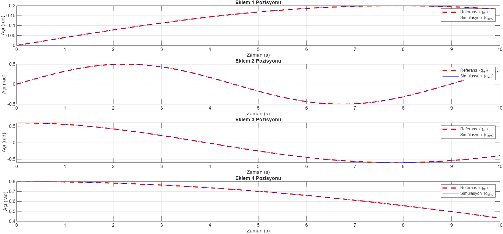

# Dynamic Test Results

Using Lagrange method, forward and inverse dynamic equations of system derived. To test the system,  
1 - created reference angle, angular velocity and angular acceleration values  
2 - Using inverse dynamics corresponding torque values calculated  
3 - Calculated torque values used as an input to the forward dynamic system and obtained response angle, angular velocity and angular acceleration vals  
4 - reference values and response values compared and plotted 

